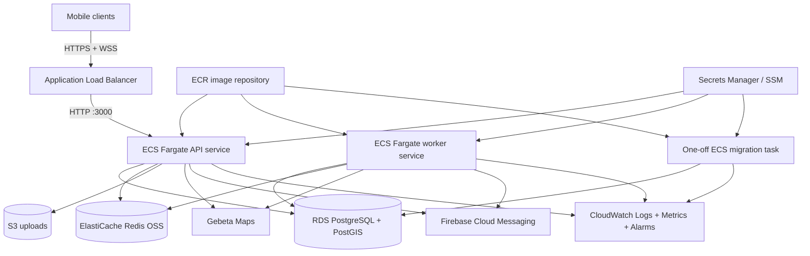

# Instant Ride AWS/Docker Deployment Topology

**Status:** Approved for V1 foundation design

**Approved date:** 2026-06-14

**Scope:** This document selects the production-compatible deployment topology that
Phase 1 and later dispatch tasks must design against. It is not an authorization to
create AWS resources, Terraform/CDK, CI/CD pipelines, runtime modules, queues, or
dispatch code without separate task approval.

## Decision Summary

Instant Ride V1 deploys the existing Dockerized NestJS backend to AWS in the
`eu-south-1` Europe (Milan) Region.

The selected topology is:

- Amazon ECR for backend container images.
- Amazon ECS on AWS Fargate for API services, worker services, and one-off migration tasks.
- An internet-facing Application Load Balancer for HTTPS and WebSocket ingress.
- Amazon RDS for PostgreSQL with PostGIS for durable business and spatial truth.
- Amazon ElastiCache for Redis OSS 7.x, node-based and cluster mode disabled for V1, for
  ephemeral presence, queue/backend coordination, and Socket.IO scaling.
- AWS Secrets Manager for secrets injected into ECS tasks; non-secret configuration in
  task environment or SSM Parameter Store.
- Amazon CloudWatch Logs, metrics, dashboards, and alarms as the first observability layer.
- RDS automated backups and point-in-time recovery; Redis remains rebuildable ephemeral
  state and is not restored as business truth.

## Production Topology

## AWS Region

The target Region is `eu-south-1` Europe (Milan).

This Region has official service endpoints for ECS, ECR, RDS, and ElastiCache. Milan is
the production assumption for backend deployment, Gebeta latency measurement, secrets,
logs, and operational alarms.

## Network Shape

Production uses one VPC with at least two Availability Zones.

- Public subnets contain the Application Load Balancer.
- Private application subnets contain ECS Fargate API, worker, and migration tasks.
- Private data subnets contain RDS PostgreSQL and ElastiCache Redis.
- ECS tasks do not receive public IP addresses in production.
- Outbound access is provided through NAT and/or VPC endpoints.
- Security groups allow:
  - internet to ALB on `443`;
  - ALB to API tasks on `3000`;
  - API and worker tasks to RDS on `5432`;
  - API and worker tasks to Redis on `6379`;
  - migration tasks to RDS on `5432`;
  - ECS task egress to required AWS services, Gebeta Maps, Firebase, and S3.

V1 may run lower environments more cheaply, but production contracts and tests must not
depend on public databases, public Redis, or single-process assumptions.

## Container Image and Runtime

The backend Docker image is built once and pushed to Amazon ECR.

The same image is reused with different ECS task commands:

| Unit      | Runtime     | Public listener | Command shape                     | Purpose                                |
| --------- | ----------- | --------------- | --------------------------------- | -------------------------------------- |
| API       | ECS Fargate | ALB `443`       | default image command             | REST API, Socket.IO, request handling  |
| Worker    | ECS Fargate | none            | worker bootstrap command override | outbox, matching, expiry, notification |
| Migration | ECS Fargate | none            | `pnpm db:migrate` or equivalent   | schema migrations before deploy        |

The current image command remains suitable for the API service. Worker and migration
commands are introduced only when their approved roadmap tasks create those bootstraps.

## API Service

The API service:

- runs behind the Application Load Balancer;
- listens on container port `3000`;
- uses `TRUST_PROXY=1` in production because Express sits behind one trusted load
  balancer hop;
- exposes readiness through `/api/v1/health`;
- must include PostgreSQL readiness before dispatch is enabled;
- must include Redis readiness before presence, matching, queues, or Socket.IO scaling
  are enabled.

D1.12 updates `/api/v1/health` to check both PostgreSQL/PostGIS and Redis readiness.
Redis readiness requires a successful ping and reports bounded failure messages without
connection details, secrets, or live-location data.

## WebSocket and Socket.IO Scaling

The Application Load Balancer is the HTTPS and WebSocket ingress point. Socket.IO live
delivery is allowed behind the ALB because Application Load Balancers support HTTP
connection upgrade to WebSocket.

Before more than one API task handles realtime traffic, V1 must prove:

- authenticated Socket.IO connection and room ownership;
- reconnect snapshot behavior;
- Redis-backed Socket.IO adapter or equivalent backplane;
- duplicate/missed event behavior under multi-instance tests;
- ALB timeout/stickiness behavior for the selected Socket.IO transports.

`D7.5` satisfied the engineering proof with a Redis-backed Socket.IO adapter and
cross-instance user/request-room tests. Production rollout still requires the Phase 8/9
capacity, failure, and staged rollout checks below.

## Worker Deployment

V1 starts with one worker service from the same backend image once worker bootstrap code
exists.

The initial worker service may own:

- outbox publishing;
- match jobs;
- delayed offer-expiration jobs;
- notification dispatch;
- reconciliation schedules.

Splitting workers by workload is a later scaling decision. The domain services remain
transaction-safe and idempotent so moving work between worker services does not change
business behavior.

## PostgreSQL and PostGIS

Production durable data runs on Amazon RDS for PostgreSQL with PostGIS enabled.

V1 chooses standard RDS PostgreSQL rather than self-hosted PostgreSQL, ECS-hosted
PostgreSQL, Aurora, or a non-PostgreSQL spatial store.

Reasons:

- Dispatch already depends on PostgreSQL transactions, constraints, and Drizzle
  migrations.
- RDS supports the PostGIS extension through normal PostgreSQL extension management.
- RDS gives managed backups, point-in-time recovery, monitoring, patching, and Multi-AZ
  options without operating a database host.
- Standard RDS is simpler than Aurora for the first production slice and can be
  re-evaluated after load data exists.

Production RDS requirements:

- private subnet placement only;
- encryption at rest;
- automated backups with point-in-time recovery;
- manual snapshot before risky production migrations;
- restricted security group ingress from API, worker, and migration task groups only;
- explicit PostGIS extension installation and migration smoke tests.

## Redis

Production Redis runs on Amazon ElastiCache for Redis OSS 7.x.

V1 chooses node-based Redis, cluster mode disabled.

Reasons:

- Redis is required for live presence, H3/geospatial indexes, Socket.IO scaling, queues,
  and short-lived locks/coordination.
- Node-based ElastiCache provides more direct control over engine version, node shape,
  Multi-AZ, maintenance, and command behavior than serverless caching.
- Cluster mode disabled avoids multi-key and Lua/script routing surprises while V1
  correctness is still being proven.
- Redis OSS 7.x stays close to common library expectations for `ioredis`, Socket.IO
  adapters, and likely queue implementations.

Valkey and ElastiCache Serverless are not rejected permanently. They require a later
compatibility spike for queues, Socket.IO adapter behavior, Lua/script usage, failover,
and local parity before replacing Redis OSS.

Redis correctness rules:

- Redis is never business truth.
- Redis loss fails closed for matching and live presence.
- Matching and reservation revalidate durable PostgreSQL generation/state.
- Redis restore is not used to recover business state.

## Secrets and Configuration

Secrets live in AWS Secrets Manager and are injected into ECS task definitions.

Secret values include:

- `DATABASE_URL` or database credential components;
- Redis auth token/password;
- JWT/session secrets;
- Gebeta Maps API token;
- Firebase private key material;
- any third-party credentials that cannot be represented by IAM.

Non-secret configuration may live in ECS task environment variables or SSM Parameter
Store, depending on the future IaC shape.

On AWS, S3 access should use ECS task IAM roles instead of static access keys. Local
development may continue to use explicit environment variables.

Important rotation rule: ECS environment-injected secrets are read when a task starts.
Rotating a secret requires a fresh task rollout or forced ECS deployment before running
tasks use the new value.

## Observability

V1 starts with CloudWatch as the required operations layer:

- ECS `awslogs` driver sends API, worker, and migration stdout/stderr to CloudWatch Logs.
- ECS service metrics track desired/running tasks, restarts, CPU, and memory.
- ALB metrics track target health, 5xx rates, latency, and connection behavior.
- RDS metrics track CPU, storage, connections, replica/Multi-AZ health if used, and
  backup status.
- ElastiCache metrics track CPU, memory, evictions, connections, replication/failover,
  and command latency where available.
- Dispatch custom metrics are introduced in `D8.1`.

Tracing is deferred. OpenTelemetry/X-Ray can be added after core dispatch flows exist,
but logs, metrics, and alarms are not optional for rollout.

Minimum alarms before production dispatch:

- ECS API desired tasks not running;
- ECS worker desired tasks not running;
- repeated task crashes;
- ALB unhealthy targets;
- elevated ALB 5xx;
- RDS low storage or connection saturation;
- Redis memory pressure, evictions, or unavailable primary;
- outbox age, queue depth, and stuck dispatch states after those metrics exist.

## Backup, Restore, and Migration Execution

RDS is the recovery source for durable dispatch truth.

Production requirements:

- RDS automated backups enabled with point-in-time recovery.
- Manual RDS snapshot before risky schema/data migrations.
- Migration runs as a one-off ECS task before API/worker rollout.
- API and worker tasks do not run migrations on startup.
- Migration logs are retained in CloudWatch.
- Migration task uses the same image artifact as the deployment it prepares.
- Restore drills are required before production rollout approval.

Redis restore is not part of correctness recovery. If Redis is lost, drivers must resume
fresh presence and queues/outbox must rebuild or retry from durable PostgreSQL state.

## Local and Integration Parity

Local Docker remains the required integration stack and now provides PostGIS parity
for spatial implementation.

Current local state:

- `docker-compose.yml` uses `postgis/postgis:18-3.6`.
- PostGIS is enabled through migration `0016_enable_postgis`.
- Database readiness checks `PostGIS_Version()`.
- Spatial convention tests run against real PostGIS and verify type, SRID, coordinate
  order, predicate behavior, and GiST index method.

Redis local parity remains `redis` plus password authentication. Future queue and
Socket.IO adapter tasks must add local multi-instance tests before production scaling.

## Out of Scope for D0.5

The following are intentionally not approved by this decision:

- Terraform/CDK/CloudFormation implementation.
- AWS account layout.
- exact instance sizes, min/max task counts, autoscaling policies, or budgets.
- CI/CD implementation.
- worker bootstrap code.
- queue library selection.
- Socket.IO adapter implementation.
- Redis Serverless, Valkey, Aurora, Kubernetes, or self-hosted database migrations.
- production launch.

## Implementation Consequences

Foundation tasks must now target this topology:

- `D1.1` added PostGIS-capable local/test infrastructure.
- `D1.2` added PostGIS spatial conventions and migration smoke-test expectations.
- `D1.4` keeps dispatch configuration typed and validated.
- `D1.5` designs queue behavior against ElastiCache Redis OSS compatibility.
- `D1.12` adds Redis readiness and fail-closed signaling.
- `D7.5` proves multi-instance Socket.IO delivery before API realtime scaling.
- `D8.1` adds custom dispatch metrics and structured logs.
- `D8.7` approves runbooks and SLOs before production rollout.

## AWS Documentation Basis

Official AWS documentation checked on 2026-06-14:

- [AWS Fargate for Amazon ECS](https://docs.aws.amazon.com/AmazonECS/latest/developerguide/AWS_Fargate.html)
- [Application Load Balancer listeners and WebSockets](https://docs.aws.amazon.com/elasticloadbalancing/latest/application/load-balancer-listeners.html)
- [RDS PostgreSQL PostGIS extension](https://docs.aws.amazon.com/AmazonRDS/latest/UserGuide/Appendix.PostgreSQL.CommonDBATasks.PostGIS.html)
- [Amazon ElastiCache overview](https://docs.aws.amazon.com/AmazonElastiCache/latest/dg/WhatIs.html)
- [Amazon ECR overview](https://docs.aws.amazon.com/AmazonECR/latest/userguide/what-is-ecr.html)
- [ECS Secrets Manager environment injection](https://docs.aws.amazon.com/AmazonECS/latest/developerguide/secrets-envvar-secrets-manager.html)
- [ECS logs to CloudWatch](https://docs.aws.amazon.com/AmazonECS/latest/developerguide/using_awslogs.html)
- [RDS automated backups](https://docs.aws.amazon.com/AmazonRDS/latest/UserGuide/USER_WorkingWithAutomatedBackups.html)
- [ECS service endpoints](https://docs.aws.amazon.com/general/latest/gr/ecs-service.html)
- [ECR service endpoints](https://docs.aws.amazon.com/general/latest/gr/ecr.html)
- [RDS service endpoints](https://docs.aws.amazon.com/general/latest/gr/rds-service.html)
- [ElastiCache service endpoints](https://docs.aws.amazon.com/general/latest/gr/elasticache-service.html)
